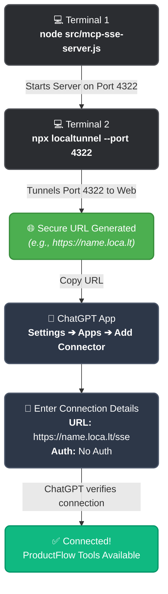

# ChatGPT MCP Integration Guide

ProductFlow includes a built-in Server-Sent Events (SSE) bridge to allow integration with ChatGPT (both the macOS Desktop App and the Web version). 

> **Important Context**: ChatGPT's Desktop app enforces strict security rules. It blocks `localhost` connections ("Unsafe URL") and it also blocks tunnels that display HTML warning pages (like the free tiers of `ngrok` or `localtunnel`). To bypass this, we use **Cloudflare Tunnel**, which provides a clean, secure HTTPS URL with no warning pages.

Follow this step-by-step guide to connect ProductFlow to ChatGPT on your Mac.

---

## Step 1: Start the ProductFlow SSE Server

First, you need to start the background server that handles the MCP tools over HTTP.

1. Open a terminal and navigate to your `productflow` project directory.
2. Run the following command:
   ```bash
   node src/mcp-sse-server.js
   ```
3. You should see a message indicating the server is running on port `4322`. **Leave this terminal window open.**

---

## Step 2: Start a Cloudflare Tunnel

We need to securely expose port `4322` to the internet so ChatGPT can reach it.

1. Open a **second** terminal window.
2. Run the following command to start Cloudflare (which is already installed on your Mac):
   ```bash
   /opt/homebrew/bin/cloudflared tunnel --url http://localhost:4322
   ```
3. Wait a few seconds, and look for a line in the output that says:
   `Your quick Tunnel has been created! Visit it at:`
   `https://random-words.trycloudflare.com`
4. **Copy that URL.** You will need it for the next step. Leave this terminal running!

---

## Step 3: Add the App to ChatGPT

Now, point ChatGPT to your Cloudflare tunnel.

1. Open the **ChatGPT macOS Desktop App**.
2. Open **Settings** (press `Cmd` + `,`).
3. Navigate to the **Apps** or **Developer** section in the sidebar.
4. Make sure **Developer mode** is toggled ON.
5. Click **Create** or **Add an App** (sometimes called "Add a Connector").
6. Fill in the connection details:
   - **Name**: ProductFlow
   - **Authentication**: Select **No Auth**
   - **URL**: Paste the URL you copied from Cloudflare, and **add `/sse` to the end**.
     *(Example: `https://random-words.trycloudflare.com/sse`)*
7. Click **Save** or **Trust**.

---

## Step 4: You're Ready!

ChatGPT will immediately make a connection to your SSE server (you will see "New connection to SSE endpoint" pop up in your first terminal window).

You can now close the settings window and start interacting with ProductFlow directly in your ChatGPT conversations! Just ask it to "call the greet tool" to get started.

> **Troubleshooting:**
> - If ChatGPT says it lost connection, your `localtunnel` URL may have expired. Just restart the `npx localtunnel --port 4322` command, get the new URL, and update the app settings in ChatGPT.
> - Ensure your `node src/mcp-sse-server.js` terminal is always running while you are using the tools.

---

## Visual Workflow


