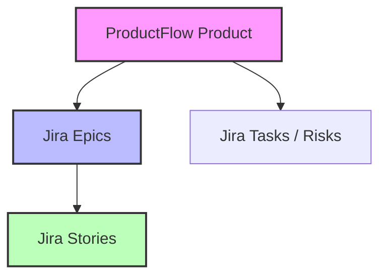

# Future Integrations: Jira Integration Mapping & Spec

This document outlines the proposed design and data structure mapping for integrating ProductFlow with Atlassian Jira, enabling the seamless export of compiled Product Requirement Documents (PRDs) and Phase 2 outputs directly into a target Jira project.

---

## Architecture & Mapping Strategy

Jira organizes tasks hierarchically (Epics $\rightarrow$ Stories/Tasks). ProductFlow maps cleanly onto this structure:



### 1. Epics (from Scope Spec / Features)
* **Source**: `scope-spec-output` or PDD `features` list.
* **Jira Type**: `Epic`
* **Fields**:
  * `summary`: Feature Title (e.g., "Personalized Wardrobe Copilot AI").
  * `description`: Overall scope description, assumptions, and constraints.
  * `customfield_10011` (Epic Name): Feature Title.

### 2. Stories (from User Stories)
* **Source**: `user-stories-output` (MoSCoW-tagged user stories).
* **Jira Type**: `Story`
* **Fields**:
  * `summary`: The User Story sentence (e.g., *“As a user, I want to upload a photo of my shirt so I can get matching pants.”*).
  * `description`: Detailed description combining:
    * **Persona / Context**
    * **Acceptance Criteria** (ordered list format)
  * `priority`: Mapped from MoSCoW:
    * `Must` $\rightarrow$ `High` / `Highest`
    * `Should` $\rightarrow$ `Medium`
    * `Could` $\rightarrow$ `Low`
    * `Won't` $\rightarrow$ Do not export (or set to `Lowest`)
  * `parent` or `epicLink`: Reference to the created Epic's key.

---

## Target Data Structures

Jira Cloud expects Atlassian Document Format (ADF) for rich text elements like descriptions. Below is the JSON payload structure that the future integration will generate.

### Epic Payload Sample
```json
{
  "fields": {
    "project": {
      "key": "PROJ"
    },
    "summary": "AI Wardrobe Styling Copilot Feature",
    "description": {
      "type": "doc",
      "version": 1,
      "content": [
        {
          "type": "paragraph",
          "content": [
            {
              "type": "text",
              "text": "Core feature scope, assumptions, and technical constraints."
            }
          ]
        }
      ]
    },
    "issuetype": {
      "name": "Epic"
    }
  }
}
```

### Story Payload Sample
```json
{
  "fields": {
    "project": {
      "key": "PROJ"
    },
    "summary": "As a user, I want to upload a photo of my shirt to get matching pants recommendations.",
    "description": {
      "type": "doc",
      "version": 1,
      "content": [
        {
          "type": "paragraph",
          "content": [
            {
              "type": "text",
              "text": "Acceptance Criteria:\n1. Image upload completes within 2 seconds.\n2. Recommender displays at least 3 matching pairs of pants."
            }
          ]
        }
      ]
    },
    "issuetype": {
      "name": "Story"
    },
    "priority": {
      "name": "High"
    },
    "customfield_10014": "PROJ-123" 
  }
}
```

---

## Future Implementation Plan

1. **Jira Exporter Utility (`utils/jira-exporter.js`)**:
   * Reads target product's `pdd-<slug>-latest.json`.
   * Maps stories, epics, and risks to the payloads above.
   * Generates a single, importable `assets/pdd/jira-import-<slug>.json`.
2. **MCP Tool Integration**:
   * Register a new tool `jira-export` in `src/mcp-server.js`.
   * Connect to an external Jira MCP server or REST endpoint using local credentials to push the generated issues automatically.
